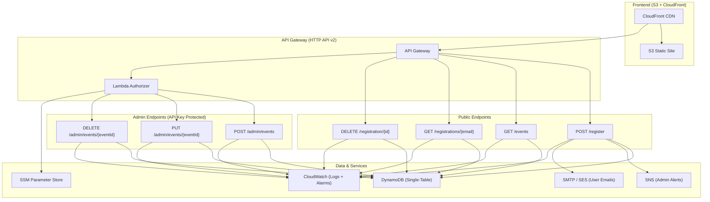

# BadexTechEvents Serverless Registration


A production-grade serverless event registration and ticketing system built on AWS.

## Project Structure

```text
event-ticketing/
├── .github/                      # CI/CD Workflows
├── .githooks/                    # Local git hooks (strip unwanted commit trailers)
├── docs/                         # Project Documentation & Troubleshoots
├── frontend/                     # Vanilla Frontend App
│   ├── public/                   # Static assets
│   ├── css/                      # Stylesheets
│   ├── js/                       # Modularized JavaScript (api.js, ui.js, app.js)
│   └── index.html
├── backend/                      # Domain-driven Lambda services
│   ├── services/
│   │   ├── events/
│   │   ├── registrations/
│   │   └── auth/
│   ├── shared/
│   └── requirements.txt
├── infrastructure/
│   ├── bootstrap/                # Shared account resources (state bucket, OIDC)
│   ├── environments/
│   │   ├── dev/
│   │   └── prod/
│   └── modules/
│       ├── api/
│       ├── compute/
│       ├── database/
│       ├── frontend/
│       └── messaging/
├── tests/
│   ├── unit/
│   └── integration/
├── Makefile
└── README.md
```

## Architecture



## Features

- **Public Registration Flow**: Users can view events, register, look up their tickets, and cancel registrations.
- **Admin Dashboard**: Full CRUD management of events, secured via API Keys (SSM).
- **Automated Emails**: Strategy pattern supports SMTP out-of-the-box, swappable to AWS SES. SMTP passwords are read from SSM at runtime (not stored in Lambda env vars).
- **Single-Table Design**: Optimized DynamoDB schema with GSIs to eliminate full-table scans.
- **Secure IaC**: Terraform with remote S3 state (`use_lockfile`) and a shared bootstrap stack for account-level resources.
- **OIDC CI/CD**: GitHub Environments (`dev` / `prod`) with separate Terraform and deploy roles.

## Public API Reference

| Endpoint | Method | Description | Example Payload |
| --- | --- | --- | --- |
| `/events` | GET | List all available events | - |
| `/register` | POST | Register for an event | `{"eventId": "aws-summit-2026", "email": "user@example.com"}` |
| `/registrations/{email}` | GET | Get user tickets | - |
| `/registration/{id}` | DELETE | Cancel a ticket | - |

## Admin API Reference

*Requires header: `x-api-key: <ADMIN_API_KEY>`*

| Endpoint | Method | Description | Example Payload |
| --- | --- | --- | --- |
| `/admin/events` | POST | Create an event | `{"eventId": "...", "eventName": "...", "date": "..."}` |
| `/admin/events/{eventId}` | PUT | Update an event | `{"eventName": "New Name"}` |
| `/admin/events/{eventId}` | DELETE | Delete an event | - |

## Deployment / Setup

### 1. Bootstrap (once per AWS account)

```bash
cd infrastructure/bootstrap
terraform init
terraform apply
```

This creates:

- S3 state bucket `event-ticketing-tfstate-<account-id>`
- Shared GitHub OIDC provider

### 2. Configure environment tfvars

```bash
cp infrastructure/environments/dev/terraform.tfvars.example \
   infrastructure/environments/dev/terraform.tfvars
cp infrastructure/environments/prod/terraform.tfvars.example \
   infrastructure/environments/prod/terraform.tfvars
# edit secrets in both files (gitignored)
```

### 3. Apply environments

Always bring up **dev** and verify it first:

```bash
make ENV=dev tf-apply
# follow docs/Testing.md
make ENV=prod tf-apply
```

### 4. GitHub Environments & Secrets

Create GitHub Environments named `dev` and `prod`. In each environment set:

| Secret | Purpose |
| --- | --- |
| `AWS_OIDC_DEPLOY_ROLE_ARN` | Role for Lambda/frontend deploys |
| `AWS_OIDC_TERRAFORM_ROLE_ARN` | Role for Terraform plan/apply |
| `API_BASE_URL` | API Gateway endpoint for frontend injection |
| `CLOUDFRONT_DIST_ID` | CloudFront distribution for invalidation |
| `TF_VAR_admin_api_key` | Terraform var |
| `TF_VAR_notification_email` | Terraform var |
| `TF_VAR_smtp_user` | Terraform var |
| `TF_VAR_smtp_password` | Terraform var |

Role ARNs come from Terraform outputs after apply.

### 5. Branch → environment mapping

| Branch | Environment |
| --- | --- |
| `dev` | GitHub Environment `dev` → `event-ticketing-dev-*` |
| `main` | GitHub Environment `prod` → `event-ticketing-prod-*` |

## Local Development

After cloning, point git at the repo's shared hooks (this setting is local and does not travel with the clone):

```bash
git config core.hooksPath .githooks
```

The hooks strip any `Co-authored-by: Cursor` / `Made-with: Cursor` trailers that agents may inject into commit messages.

```bash
pip install -r requirements-dev.txt
make lint
make test          # unit tests only
```

See [docs/Testing.md](docs/Testing.md) for the full verify-before-prod ladder, and `CONTRIBUTING.md` for branching.
