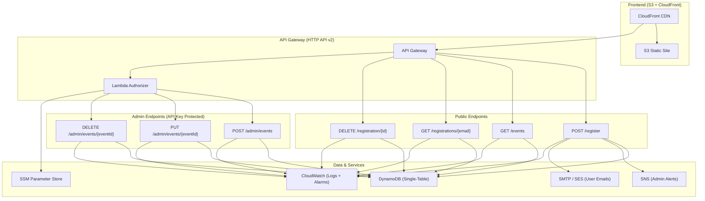

# BadexTechEvents Serverless Registration

A production-grade serverless event registration and ticketing system built on AWS. 

## Architecture

## Features
- **Public Registration Flow**: Users can view events, register, look up their tickets, and cancel registrations.
- **Admin Dashboard**: Full CRUD management of events, secured via API Keys (SSM).
- **Automated Emails**: Strategy pattern supports SMTP (e.g. Gmail) out-of-the-box, easily swappable to AWS SES for production.
- **Single-Table Design**: Optimized DynamoDB schema with GSIs to eliminate full-table scans.
- **Secure IaC**: Terraform with remote state (S3 backend) and DynamoDB state locking.
- **OIDC CI/CD**: GitHub Actions pipeline for linting, testing (Moto), and automated deployment.

## Public API Reference

| Endpoint | Method | Description | Example Payload |
| --- | --- | --- | --- |
| `/events` | GET | List all available events | - |
| `/register` | POST | Register for an event | `{"eventId": "aws-summit-2026", "email": "user@example.com"}` |
| `/registrations/{email}` | GET | Get user tickets | - |
| `/registration/{id}` | DELETE | Cancel a ticket | - |

## Admin API Reference
*Requires header: `x-api-key: <ADMIN_API_KEY>`*

| Endpoint | Method | Description | Example Payload |
| --- | --- | --- | --- |
| `/admin/events` | POST | Create an event | `{"eventId": "...", "eventName": "...", "date": "..."}` |
| `/admin/events/{eventId}` | PUT | Update an event | `{"eventName": "New Name"}` |
| `/admin/events/{eventId}` | DELETE | Delete an event | - |

## Deployment / Setup

1. **Bootstrap Terraform State**
   Create an S3 bucket (`event-ticketing-tfstate-12345`) and DynamoDB table (`terraform-state-lock`) in your AWS account manually first.
   
2. **Set up Secrets in GitHub**
   Configure the following secrets in your GitHub repository:
   - `AWS_OIDC_ROLE_ARN`: The ARN of the IAM role for GitHub Actions
   - `TF_VAR_admin_api_key`: Your chosen secret key for the admin panel
   - `TF_VAR_smtp_password`: Your SMTP App Password
   - `VUE_APP_API_URL`: The output API endpoint from Terraform
   - `CLOUDFRONT_DIST_ID`: The output CloudFront ID from Terraform

3. **Deploy**
   Pushing to `main` will automatically apply the Terraform state and deploy the updated Lambda code and frontend assets.

## Local Development
Run `make test` to execute the full pytest suite. We use `moto` to mock AWS services entirely in memory, meaning you can test everything locally without hitting real AWS endpoints.
See `CONTRIBUTING.md` for our branching strategy.