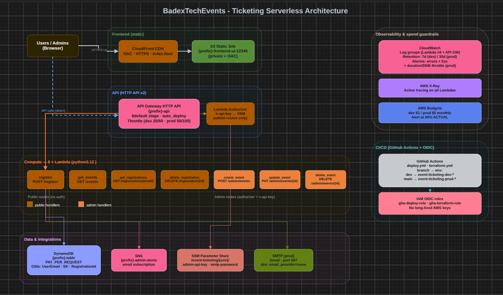
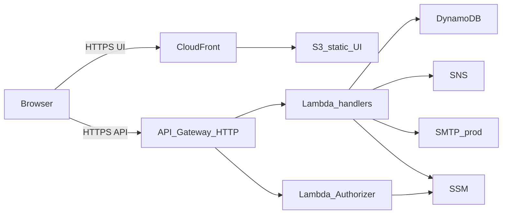
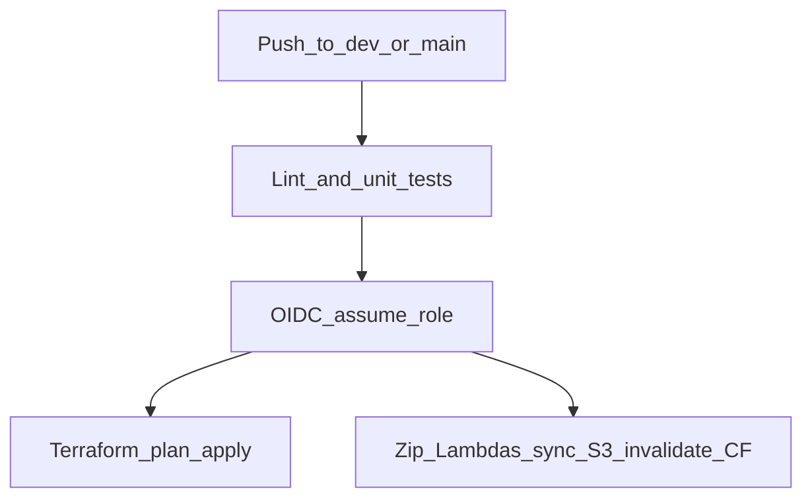

# BadexTechEvents — Event Registration & Ticketing System


A serverless Event Registration & Ticketing System on AWS — a scalable REST API that replaces Microsoft Forms + Excel, with Terraform IaC, GitHub Actions OIDC CI/CD, and separate `dev` / `prod` environments.

**Live UI (prod):** [https://d3eayustnpc41q.cloudfront.net](https://d3eayustnpc41q.cloudfront.net)

---

## Objectives

> Design, architect, and build a serverless Event Registration & Ticketing System using AWS Cloud Services. The system replaces Microsoft Forms + Excel with a scalable REST API.
>
> Additional tools are welcome while producing the expected output.

This repo delivers that: API + Lambdas + DynamoDB + CloudWatch alarms + Terraform + CI/CD, plus a CloudFront UI, admin dashboard, cost controls, and tests.

---

## Demo

### Try it live

1. Open the [prod app](https://d3eayustnpc41q.cloudfront.net).
2. Browse events, register, look up tickets, cancel.
3. Admin: open [`#admin`](https://d3eayustnpc41q.cloudfront.net/#admin) and sign in with the admin API key from SSM (`/event-ticketing/prod/admin-api-key`).

### Video walkthrough

**[Watch the demo](./demo.mp4)** · [View on GitHub](https://github.com/Manu-world/serveless-event-ticketing/blob/main/demo.mp4)

---

## Problem

Event registration for workshops and meetups often lives in **Microsoft Forms + Excel**:

- No real HTTP API for other systems to call
- Weak access control for admin-style changes
- Manual ops — no infrastructure as code, no repeatable deploys
- Does not scale or fail independently under load
- Hard to attach alerts, confirmation email, or useful logs

Organizers need a secure, low-cost, auto-scaling registration desk with public self-service and a protected admin surface.

---

## Solution

A fully serverless stack on AWS:

| Concern | Approach |
| --- | --- |
| Public API | API Gateway **HTTP API v2** — list events, register, look up tickets, cancel |
| Admin API | Same API + Lambda authorizer (`x-api-key` → SSM) for event CRUD |
| Compute | **8 Lambda** functions (Python 3.12), 128 MB, 15s, X-Ray tracing |
| Data | **DynamoDB** single-table design + GSIs (Query, not Scan) |
| UI | Static site on **S3 + CloudFront** (OAC); browser calls the API directly |
| Alerts / email | **SNS** admin alerts; SMTP confirmations in prod (`email_provider=none` in dev) |
| Secrets | **SSM Parameter Store** (SecureString) |
| Infra | **Terraform** modules + `bootstrap` + `dev` / `prod`, S3 remote state |
| CI/CD | **GitHub Actions** + IAM **OIDC** (no long-lived AWS keys in GitHub) |
| Cost | AWS Budgets (**$1** dev / **$5** prod), slim-dev defaults — [docs/Cost-Analysis.md](docs/Cost-Analysis.md) |

Also included: modular Terraform, separate OIDC deploy vs terraform roles, integration smoke tests, and an admin UI.

---

## Architecture



Draw.io source: [docs/architecture.drawio](docs/architecture.drawio) · Cost notes: [docs/Cost-Analysis.md](docs/Cost-Analysis.md)



CloudFront serves the static UI only. The browser calls API Gateway directly (CORS allows the CloudFront origin).

---

## Capstone deliverables map

| Deliverable | Location in this repo |
| --- | --- |
| API / Lambda code | [`backend/services/`](backend/services/) (events, registrations, auth) + [`backend/shared/`](backend/shared/) |
| Lambda definitions (IaC) | [`infrastructure/modules/compute/`](infrastructure/modules/compute/) |
| DynamoDB table + GSIs | [`infrastructure/modules/database/`](infrastructure/modules/database/) |
| CloudWatch alarms / log retention | [`infrastructure/environments/dev/monitoring.tf`](infrastructure/environments/dev/monitoring.tf), [`…/prod/monitoring.tf`](infrastructure/environments/prod/monitoring.tf) |
| Terraform infra | [`infrastructure/`](infrastructure/) — `bootstrap/`, `modules/`, `environments/{dev,prod}/` |
| CI/CD (GitHub Actions) | [`.github/workflows/deploy.yml`](.github/workflows/deploy.yml), [`.github/workflows/terraform.yml`](.github/workflows/terraform.yml) |
| Architecture diagram | [`architecture.png`](./architecture.png) + [`docs/architecture.drawio`](docs/architecture.drawio) |
| Cost / env separation | [`docs/Cost-Analysis.md`](docs/Cost-Analysis.md) |
| Tests | [`tests/unit/`](tests/unit/), [`tests/integration/`](tests/integration/) |
| Product presentation | This README + [`demo.mp4`](./demo.mp4) |

---

## CI/CD pipeline



| Branch | GitHub Environment | AWS prefix |
| --- | --- | --- |
| `dev` | `dev` | `event-ticketing-dev-*` |
| `main` | `prod` | `event-ticketing-prod-*` |

- **OIDC** — `gha-terraform-role` and `gha-deploy-role` per environment; no static AWS keys in GitHub.
- **Path-aware Terraform** — runs when `infrastructure/**` changes.
- **Deploy** — packages `backend/`, updates all eight functions, injects `API_BASE_URL` into `index.html`, syncs S3, invalidates CloudFront.
- **Concurrency** — shared `aws-${{ github.ref }}` group so Terraform and Deploy do not race Lambda code updates.
- **Code ownership** — after create, the deploy workflow owns Lambda zip updates; Terraform manages infra config.

---

## Infrastructure highlights

- **HTTP API v2**
- **DynamoDB on-demand** + single-table GSIs (`UserEmailIndex`, `SKIndex`, `RegistrationIdIndex`)
- **Remote state** in S3 with native lockfile; **bootstrap** owns the state bucket + GitHub OIDC provider
- **SSM SecureString** for admin API key and SMTP password
- **Budgets:** `$1` (dev) / `$5` (prod), alert at **80%** actual
- **Slim dev:** 7-day logs, no PITR, fewer alarms, `email_provider=none`
- **Hardened prod:** 30-day logs, PITR, deletion protection, detailed duration/throttle alarms, SMTP on

Full verify ladder: [docs/Testing.md](docs/Testing.md).

---

## Features

- **Public flow** — list events, register, look up tickets by email, cancel by registration ID
- **Admin dashboard** — create/list/delete events behind API key login (`#admin`)
- **Email** — SMTP in prod, swappable toward SES; password from SSM at runtime
- **Observability** — CloudWatch logs + error/5xx alarms (more in prod); X-Ray Active on Lambdas

---

## Public API reference

| Endpoint | Method | Description | Example payload |
| --- | --- | --- | --- |
| `/events` | GET | List events | — |
| `/register` | POST | Register for an event | `{"eventId": "aws-summit-2026", "email": "user@example.com"}` |
| `/registrations/{email}` | GET | Tickets for an email | — |
| `/registration/{id}` | DELETE | Cancel a ticket | — |

## Admin API reference

Requires header: `x-api-key: <ADMIN_API_KEY>`

| Endpoint | Method | Description | Example payload |
| --- | --- | --- | --- |
| `/admin/events` | POST | Create an event | `{"eventId": "...", "eventName": "...", "date": "..."}` |
| `/admin/events/{eventId}` | PUT | Update an event | `{"eventName": "New Name"}` |
| `/admin/events/{eventId}` | DELETE | Delete an event | — |

---

## Challenges & lessons learned

Issues that came up while standing up `dev` / `prod` and CI (more in [docs/Troubleshoots.md](docs/Troubleshoots.md)):

- **OIDC subjects** — jobs that set `environment:` get `environment:…` claims, not only `ref:refs/heads/…`, so the IAM trust policy has to allow both.
- **Lambda update races** — Terraform and the deploy workflow both updating function code caused 409 conflicts; fixed with a shared concurrency group and letting deploy own the zip after create.
- **tfvars vs CI defaults** — non-secret settings only in a gitignored `terraform.tfvars` made local and CI applies disagree; secrets stay in tfvars, the rest use `variables.tf` defaults.
- **Reserved concurrency** — reserved limits burned the account quota, so they were removed for on-demand scaling.

---

## Project structure

```text
event-ticketing/
├── demo.mp4                      # Product demo video
├── architecture.png              # Architecture diagram
├── .github/workflows/            # deploy.yml · terraform.yml
├── .githooks/                    # Local git hooks
├── docs/
│   ├── architecture.drawio       # Draw.io source for architecture.png
│   ├── Cost-Analysis.md
│   ├── Testing.md
│   └── Troubleshoots.md
├── frontend/                     # Vanilla UI (css/, js/, index.html)
├── backend/                      # Domain Lambdas (events, registrations, auth)
├── infrastructure/
│   ├── bootstrap/                # State bucket + GitHub OIDC provider
│   ├── environments/{dev,prod}/
│   └── modules/{api,compute,database,frontend,messaging}/
├── tests/{unit,integration}/
├── Makefile
└── README.md
```

---

## Quick start

### Local checks (no AWS)

```bash
git clone git@github.com:Manu-world/serveless-event-ticketing.git
cd serveless-event-ticketing
git config core.hooksPath .githooks

pip install -r requirements-dev.txt
make lint
make test
```

### Deploy overview

1. **Bootstrap once** — `infrastructure/bootstrap` (state bucket + OIDC provider).
2. **Copy tfvars** — secrets only from `terraform.tfvars.example` (gitignored).
3. **Apply `dev` first** — follow [docs/Testing.md](docs/Testing.md), then `prod`.
4. **GitHub Environments** — `dev` / `prod` with OIDC role ARNs, `API_BASE_URL`, `CLOUDFRONT_DIST_ID`, and `TF_VAR_*` secrets.

```bash
make ENV=dev tf-plan
make ENV=dev tf-apply
# after verification:
make ENV=prod tf-plan
make ENV=prod tf-apply
```

Frontend deploy (injects API URL):

```bash
make ENV=dev deploy-frontend \
  CLOUDFRONT_DIST_ID=... \
  API_BASE_URL=https://....execute-api.us-east-1.amazonaws.com
```

---

## License

See [LICENSE](LICENSE).
